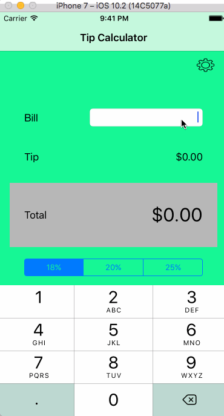

## Synopsis

The Project Developed is a Tip Calculator. It calculates tip based on the Bill amount taken from the input and the tip percentage option chosen from the UISegmentedControl. 
The app also has a setting page that lets you dynamically change your 3 favorite tip settings. 

## Application Functionalities

1. App accepts Decimal input and calculates tip and total value.
2. The setting screen takes 3 integer inputs for 3 favorite tip percentage settings.
3. There is a “Save” button who’s action is set to stores the input values as an NSArray object of 3 values in NSUserDefaults.
5. Upon successful saving, the app notifies the user by showing a popup confirmation message using UIAlertController.
4. The “Cancel” button resets the input fields and cancel’s action.
5. After the data comes back to the ViewController from the SettingController, in the “viewWillAppear” event, it reads the NSArray from the NSUserDefault. The reason for using this event is because this is triggered every time the view is displayed and changes even when the control goes to another ViewController and comes back. 
6. The received value is then set to the UISegmentedControl title.
7. Henceforth, tip calculation takes place with the new setting.
8. The bill amount, tip and total is reset every time the setting is changed.

## Motivation

This project is developed as a sincere attempt to get into the iOS App Development Bootcamp. I am very passionate about App Development and would love to learn more. 

## License

Copyright © 2017 Pavani Vellal. All rights reserved.
